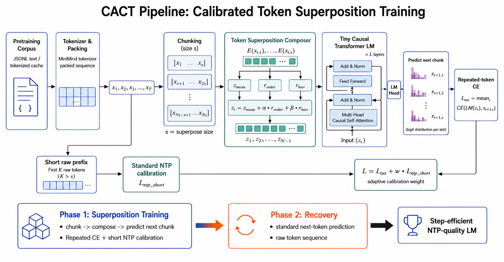

# CACT: Calibrated Token Superposition Training

This repository is a compact research prototype for faster language-model pretraining with Token Superposition Training (TST).



The main experiment is **CACT** (Conflict-Aware Calibrated TST): a lightweight residual TST variant that keeps the paper-style repeated-token cross entropy objective, then adds a small online calibration loss during the superposition phase. The goal is to make TST reach the same NTP quality in fewer training steps.

## Key Result

On the current MiniMind-style pretraining setup, CACT at 100k steps matches or slightly improves the 120k-step vanilla TST baseline.

| Run | Steps | `loss_eval_ntp` |
| --- | ---: | ---: |
| NTP baseline | 120k | 2.96304 |
| Vanilla TST | 120k | 2.91560 |
| CACT seed 42 | 100k | 2.90588 |
| CACT seed 43 | 100k | 2.91603 |
| CACT mean | 100k | 2.91096 |

This is a small but reproducible step-efficiency gain in this setting. It should be read as a focused training-efficiency result, not as a broad claim across all datasets or model scales.

## Method

Vanilla TST compresses each group of `s` tokens into one latent token and trains the same LM head against every next-token slot:

```text
z_t = mean(E(x_t,1), ..., E(x_t,s))
L_tst = mean_i CE(LM(z_t), x_{t+1,i})
```

CACT keeps that objective and uses a lightweight residual composer:

```text
z = z_mean + alpha * r_order + beta * r_hier
```

During superposition training, CACT adds a short-sequence NTP calibration term:

```text
L = L_tst + w * L_ntp_short
```

The calibration weight is adjusted from the ratio between the calibration loss and the TST loss. Recovery remains standard NTP training.

## Setup

Use a project-local Python environment.

```bash
pip install -r requirements.txt
```

Create a tiny local dataset and run CPU smoke tests:

```bash
bash scripts/hst_local_verify.sh
```

The smoke test writes only under `hst_runs/`.

## Data Preparation

Full runs expect a MiniMind tokenizer and a pretraining JSONL file:

```text
dataset/pretrain_t2t.jsonl
tokenizer/minimind_tokenizer/
```

Build the packed token cache once:

```bash
python3 scripts/hst_tokenize_dataset.py \
  --input ./dataset/pretrain_t2t.jsonl \
  --output ./hst_tmp/tokenized/pretrain_t2t_packed_seq3072.pt \
  --tokenizer_path ./tokenizer/minimind_tokenizer \
  --seq_len 3072 \
  --pack_documents 1 \
  --dtype int32
```

## Training

Run the main baselines:

```bash
python3 trainer/train_hst_pretrain.py --config configs/hst/ntp_baseline_full_120k.yaml
python3 trainer/train_hst_pretrain.py --config configs/hst/vanilla_tst_s4_r03_full_120k.yaml
```

Run CACT replicas:

```bash
python3 trainer/train_hst_pretrain.py --config configs/hst/cact_s4_r05_seq384_100k_seed42.yaml
python3 trainer/train_hst_pretrain.py --config configs/hst/cact_s4_r05_seq384_100k_seed43.yaml
```

Each run writes checkpoints and metrics under `hst_runs/`.

## Evaluation

Collect run summaries:

```bash
python3 scripts/hst_collect_metrics.py --runs_dir ./hst_runs --output_dir ./hst_outputs
```

For stronger checkpoint evaluation:

```bash
python3 scripts/hst_offline_eval.py \
  --run_dir ./hst_runs/CACT100_seed42_s4_r05_seq384 \
  --device cuda \
  --eval_max_batches 200
```

## Negative Results

Several exploratory branches were removed from the public path because they did not produce stable gains:

- anchor-only sparse residual supervision
- residual codebook auxiliary targets
- adaptive recovery switching
- recovery warm-start calibration

The current public version keeps the smaller, easier-to-reproduce CACT result.
